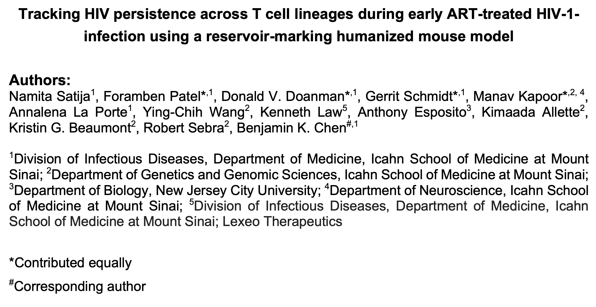

This repository contains all the necessary scripts related to the Satija et al 2023 manuscript.

The man script follows the workflow as seen below and was which was performed on all our datasets separately. Further scripts are organized by the purpose they relate to. All scripts are minimally commented to be functional and reproducible, however it is to be noted that they do not serve as tutorials. Individual threshold and cutoff values are furthermore noted to serve reproducibility. If any questions arise please feel free to start an issue or email [gerrit.schmidt\@mss.edu](mailto:gerrit.schmidt@mss.edu){.email}, [don.doanman\@icahn.mssm.edu](mailto:don.doanman@icahn.mssm.edu){.email}, or [Benjamin.chen\@mssm.edu](mailto:Benjamin.chen@mssm.edu){.email}

{width="356"}
